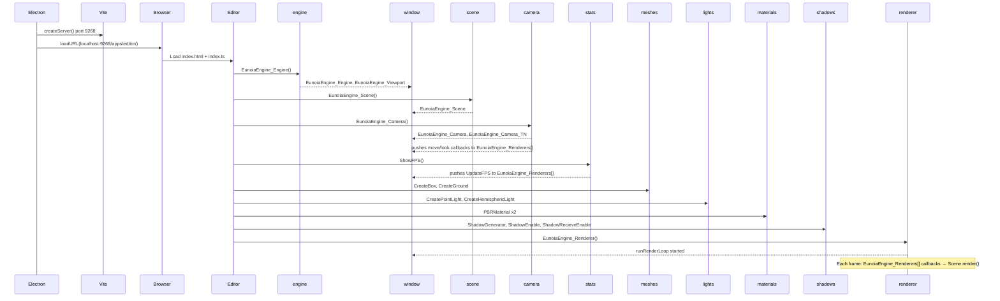

# Eunoia Engine — Project Details

> A modular, plugin-based 3D engine built on top of **BabylonJS**, running inside an **Electron** window with a **Vite** dev server. Written entirely in **TypeScript**.

---

## Table of Contents

1. [Overview](#overview)
2. [Technology Stack](#technology-stack)
3. [Directory Structure](#directory-structure)
4. [Runtime Architecture](#runtime-architecture)
5. [Global State Model](#global-state-model)
6. [Plugins](#plugins)
7. [Shared Types](#shared-types)
8. [Entry Point — Editor App](#entry-point--editor-app)
9. [Electron Window](#electron-window)
10. [Plugin Issues Found](#plugin-issues-found)
11. [Startup Sequence](#startup-sequence)

---

## Overview

Eunoia Engine is a **modular 3D game/editor engine** designed around a plugin architecture. Each plugin is a self-contained folder that exposes a clean API surface. Plugins communicate with each other through a **shared global namespace** on `window` rather than direct imports, keeping them loosely coupled.

The engine runs inside an Electron application. The Vite dev server serves the editor UI (`apps/editor/`) and hot-reloads changes during development.

---

## Technology Stack

| Layer | Technology |
|---|---|
| **3D Engine** | BabylonJS `^9.19.0` (WebGL + WebGPU) |
| **Desktop Shell** | Electron `^43.2.0` |
| **Dev Server / Bundler** | Vite `^8.2.0` |
| **Language** | TypeScript |
| **Package Manager** | pnpm |
| **File I/O** | `fs-extra ^11.4.0` |

---

## Directory Structure

```
Eunoia Engine Development/
│
├── apps/
│   └── editor/
│       ├── index.html          # Editor UI — canvas + FPS overlay
│       └── index.ts            # Editor entry point — wires all plugins
│
├── plugins/                    # All engine plugins (modular, independent)
│   ├── registry.plugins.ts     # Centralized EngineRegistry state locator
│   ├── camera.plugins/
│   ├── engine.plugins/
│   ├── file-system.plugins/
│   ├── lights.plugins/
│   ├── materials.plugins/
│   ├── meshes.plugins/
│   ├── renderer.plugins/
│   ├── scene.plugins/
│   ├── shadows.plugins/
│   └── stats.plugins/
│
├── types/
│   └── meshes.types.ts         # Shared TypeScript interfaces for meshes
│
├── window/
│   └── index.js                # Electron main process
│
├── package.json
└── pnpm-lock.yaml
```

### Each Plugin Structure

```
plugins/<name>.plugins/
├── index.ts              # Public API — re-exports from private/
├── package.json          # Plugin package metadata
└── private/
    ├── Core.ts           # Main plugin logic
    └── <Helpers>.ts      # Supporting utilities (if any)
```

---

## Runtime Architecture

```
Electron Main Process (window/index.js)
    └── Vite Dev Server (port 9268)
            └── BrowserWindow → http://localhost:9268/apps/editor/
                    └── apps/editor/index.html
                            └── apps/editor/index.ts
                                    ├── EunoiaEngine_Engine()    → BabylonJS Engine
                                    ├── EunoiaEngine_Scene()     → BabylonJS Scene
                                    ├── EunoiaEngine_Camera()    → viewport camera
                                    ├── EunoiaEngine_Stats       → FPS counter
                                    ├── EunoiaEngine_Meshes      → 3D mesh creation
                                    ├── EunoiaEngine_Light       → lighting
                                    ├── EunoiaEngine_Materials   → PBR materials
                                    ├── EunoiaEngine_Shadows     → shadow generators
                                    └── EunoiaEngine_Renderer()  → render loop
```

---

## Centralized State Model (`EngineRegistry`)

All plugins share state through `EngineRegistry` exported from `plugins/registry.plugins.ts`. This decouples plugins from `window`, avoids circular imports, and acts as a centralized service-locator pattern.

| Registry Key | Type | Written By | Read By |
|---|---|---|---|
| `EngineRegistry.EunoiaEngine_Viewport` | `HTMLCanvasElement` | `engine.plugins` | `engine.plugins`, `renderer.plugins`, `camera.plugins` |
| `EngineRegistry.EunoiaEngine_Engine` | `Engine \| WebGPUEngine` | `engine.plugins` | `scene.plugins`, `renderer.plugins`, `stats.plugins`, `camera.plugins` |
| `EngineRegistry.EunoiaEngine_GraphicsAPI` | `'WEB_GL' \| 'WEB_GPU'` | `engine.plugins` | informational |
| `EngineRegistry.EunoiaEngine_Scene` | `Scene` | `scene.plugins` | `camera.plugins`, `meshes.plugins`, `lights.plugins`, `materials.plugins`, `shadows.plugins` |
| `EngineRegistry.EunoiaEngine_Camera` | `FreeCamera` | `camera.plugins` | `camera.plugins` |
| `EngineRegistry.EunoiaEngine_Camera_TN` | `TransformNode` | `camera.plugins` | camera controls |
| `EngineRegistry.EunoiaEngine_Renderer` | loop ref | `renderer.plugins` | `renderer.plugins` |
| `EngineRegistry.EunoiaEngine_Renderers` | `Function[]` | `renderer.plugins` | `camera.plugins`, `stats.plugins` |
| `EngineRegistry.EunoiaEngine_Materials` | `PBRMaterial[]` | `materials.plugins` | materials registry |
| `EngineRegistry.EunoiaEngine_ShadowGenerators` | `ShadowGenerator[]` | `shadows.plugins` | `shadows.plugins` |

---

## Plugins

---

### engine

**Path:** `plugins/engine/`  
**Purpose:** Initialises the BabylonJS rendering engine on the `#viewport` canvas.

**API:**
```ts
EunoiaEngine_Engine(type?: 'WEB_GL' | 'WEB_GPU'): Promise<void>
```

**Behaviour:**
- No arg / `'WEB_GL'` → creates standard BabylonJS `Engine`
- `'WEB_GPU'` → creates `WebGPUEngine` and calls `.initAsync()`
- Disposes previous engine if one exists
- Registers a `window resize` listener → `ViewportResize()`

**Globals written:** `EunoiaEngine_Viewport`, `EunoiaEngine_Engine`, `EunoiaEngine_GraphicsAPI`

**Files:** `private/Core.ts`, `private/ViewportResize.ts`

---

### scene

**Path:** `plugins/scene/`  
**Purpose:** Creates a BabylonJS `Scene` on the current engine.

**API:**
```ts
EunoiaEngine_Scene(scene?: string): Promise<void>
```

**Behaviour:**
- Disposes existing scene, creates a fresh `Scene` from `window.EunoiaEngine_Engine`
- The `scene` string param is a placeholder — currently unused

**Globals written:** `EunoiaEngine_Scene`

**Files:** `private/Core.ts`

---

### camera

**Path:** `plugins/camera/`  
**Purpose:** Sets up a viewport camera with WASD + mouse-look controls.

**API:**
```ts
EunoiaEngine_Camera(camera?: FreeCamera): Promise<void>
```

**Behaviour:**
- No arg → creates default `ViewportCamera` (FreeCamera + parent TransformNode)
- Custom camera passed → sets it as the active scene camera
- Always calls `ViewportControlsDisable()` first to clean up prior controls
- Registers `ViewportControlsUpdate` and `ViewportLooksControlsUpdate` into `EunoiaEngine_Renderers[]`

**Default camera:**
- `FreeCamera` at `(0, 3, -8)`, parent `TransformNode` at `(0, 2, -10)`
- Right-click drag → mouse look (pointer lock)
- `W/A/S/D` → move, `Q/E` → down/up

**Globals written:** `EunoiaEngine_Camera`, `EunoiaEngine_Camera_TN`

**Files:** `private/Core.ts`, `private/ViewportCamera.ts`

---

### renderer

**Path:** `plugins/renderer/`  
**Purpose:** Starts the BabylonJS render loop, dispatching per-frame callbacks.

**API:**
```ts
EunoiaEngine_Renderer(): Promise<void>
```

**Behaviour:**
- Starts `Engine.runRenderLoop()` which each frame:
  1. Calls all functions in `window.EunoiaEngine_Renderers[]`
  2. Calls `Scene.render()`
- Calls `ViewportResize()` to set initial canvas size

**Must be called last** — after all scene setup, camera, and stats are initialised.

**Globals init:** `EunoiaEngine_Renderer`, `EunoiaEngine_Renderers`

**Files:** `private/Core.ts`, `private/Viewport.ts`

---

### meshes

**Path:** `plugins/meshes/`  
**Purpose:** Factory functions for 3D primitives.

**API:**
```ts
EunoiaEngine_Meshes.CreateBox(name: string, options: BoxMeshInterface): Promise<Mesh>
EunoiaEngine_Meshes.CreateGround(name: string, options: GroundMeshInterface): Promise<Mesh>
```

**Globals read:** `EunoiaEngine_Scene`

**Types:** Uses `types/meshes.types.ts` from the project root.

**Files:** `private/Core.ts`

---

### lights

**Path:** `plugins/lights/`  
**Purpose:** Factory functions for all BabylonJS light types.

**API:**
```ts
EunoiaEngine_Light.CreatePointLight(name, position): Promise<PointLight>
EunoiaEngine_Light.CreateDirectionalLight(name, direction): Promise<DirectionalLight>
EunoiaEngine_Light.CreateSpotLight(name, pos, dir, angle, exp): Promise<SpotLight>
EunoiaEngine_Light.CreateRectAreaLight(name, pos, w, h): Promise<RectAreaLight>
EunoiaEngine_Light.CreateHemisphericLight(name, direction): Promise<HemisphericLight>
```

**Globals read:** `EunoiaEngine_Scene`

**Files:** `private/Core.ts`

---

### materials

**Path:** `plugins/materials/`  
**Purpose:** Creates fully configured PBR materials with async parallel texture loading.

**API:**
```ts
EunoiaEngine_Materials.PBRMaterial(
    name: string,
    textures: TexturesPath_Interface,    // URL strings per slot
    levels: TextureLevels_Interface,     // brightness per texture
    uvScale: TextureUVScale_Interface,   // u/v tiling
    colors: MaterialColors_Interface,    // Color3 values
    values: MaterialValues_Interface     // metallic, roughness, alpha...
): Promise<PBRMaterial>
```

**Texture slots:** `albedo`, `metallic`, `emissive`, `bump`, `ambient`, `opacity`, `reflectivity`, `reflectance`, `reflection`

**Behaviour:**
- All textures loaded in parallel via `Promise.all`
- UV scale and level applied to each loaded texture
- Material pushed into `window.EunoiaEngine_Materials[]`

**Globals written:** `EunoiaEngine_Materials[]`

**Files:** `private/Core.ts`, `private/types.ts`

---

### shadows

**Path:** `plugins/shadows/`  
**Purpose:** Manages shadow casters and receivers across all shadow generators.

**API:**
```ts
EunoiaEngine_Shadows.ShadowGenerator(light, resolution?): Promise<ShadowGenerator>
EunoiaEngine_Shadows.ShadowEnable(mesh): Promise<void>
EunoiaEngine_Shadows.ShadowDisable(mesh): Promise<void>
EunoiaEngine_Shadows.ShadowRecieveEnable(mesh): Promise<void>
EunoiaEngine_Shadows.ShadowRecieveDisable(mesh): Promise<void>
```

**Resolution options:** `2 | 4 | 8 | ... | 4096` (default: `512`)

**Behaviour:**
- `ShadowGenerator` creates a generator with a random unique ID
- `ShadowEnable` adds the mesh to **all** registered generators
- `ShadowRecieveEnable` sets `mesh.receiveShadows = true`

**Globals written:** `EunoiaEngine_ShadowGenerators[]`

**Files:** `private/Core.ts`

---

### stats

**Path:** `plugins/stats/`  
**Purpose:** Displays live FPS in the `#fps` DOM element each frame.

**API:**
```ts
EunoiaEngine_Stats.ShowFPS(show?: boolean): Promise<void>
```

**Behaviour:**
- Pushes `UpdateFPS` into `window.EunoiaEngine_Renderers[]`
- Each frame reads `Engine.getFps()` and writes to `#fps`
- DOM element `#fps` is queried at module load time

**Globals read:** `EunoiaEngine_Engine`, `EunoiaEngine_Renderers`

**Files:** `private/Core.ts`

---

### file-system

**Path:** `plugins/file-system/`  
**Purpose:** Exposes `fs-extra` Node.js file I/O with full TypeScript types.

**API:**
```ts
EunoiaEngine_FileSystem  // All fs-extra methods: readFile, writeFile, copy, move, ensureDir, etc.
```

**Behaviour:**
- Uses `require('fs-extra')` (CommonJS) for runtime
- Re-exports with `import type` for TypeScript intellisense
- Requires Electron `nodeIntegration: true`

**Files:** `private/index.ts`

---

## Shared Types

**Path:** `types/`

| File | Interfaces |
|---|---|
| `meshes.types.ts` | `BoxMeshInterface`, `GroundMeshInterface` |

### BoxMeshInterface
```ts
{
  size?, width?, height?, depth?,
  faceUV?, faceColors?,
  sideOrientation?, frontUVs?, backUVs?,
  wrap?, topBaseAt?, bottomBaseAt?, updatable?
}
```

### GroundMeshInterface
```ts
{
  width?, height?,
  subdivisions?, subdivisionsX?, subdivisionsY?,
  updatable?
}
```

The `materials` plugin defines its own types in `plugins/materials/private/types.ts`.

---

## Entry Point — Editor App

**Path:** `apps/editor/`

### index.html

- Canvas `#viewport` (1080x720), no border/outline
- `<h1 id="fps">` overlay (white, top-left, z-index 100)
- Loads `index.ts` as a native ES module via Vite

### index.ts — Startup Order

```
1.  EunoiaEngine_Engine()              — WebGL engine on #viewport
2.  EunoiaEngine_Scene()               — fresh BabylonJS scene
3.  EunoiaEngine_Camera()              — viewport camera + WASD/mouse controls
4.  EunoiaEngine_Stats.ShowFPS()       — FPS counter registered in render loop

    --- scene content ---
5.  CreateBox('Name 01', { size: 2 })
6.  CreatePointLight @ (4,4,-4), intensity 25
7.  CreateGround('Name 03', 10x10)
8.  CreateHemisphericLight @ up, intensity 0.01
9.  PBRMaterial (solid blue albedo → cube)
10. PBRMaterial (forest ground textures, UV 4x4, roughness 1 → ground)
11. Assign materials to meshes
12. ShadowGenerator(pointLight, resolution 1024)
13. ShadowRecieveEnable(ground)
14. ShadowEnable(cube)

15. EunoiaEngine_Renderer()            — starts render loop (always last)
```

---

## Electron Window

**Path:** `window/index.js`

| Setting | Value |
|---|---|
| Vite server port | `9268` |
| Window size | `1080 x 720` (auto-maximised) |
| Frame | visible |
| Menu bar | hidden (`autoHideMenuBar: true`) |
| `nodeIntegration` | `true` (required for file-system plugin) |
| `contextIsolation` | `false` |
| `backgroundThrottling` | `false` (render loop runs when unfocused) |

---

## Plugin Issues Found

| # | Plugin | Issue | Severity |
|---|---|---|---|
| 1 | `renderer` | `Core.ts` imports `ViewportResize` from `../../engine/private/ViewportResize` — a cross-plugin private import. Its own `private/Viewport.ts` is identical but unused. | Medium |
| 2 | `renderer` | `(window as any).EunoiaEngine_Renderers = []` runs unconditionally at module evaluation, wiping callbacks already pushed by `camera` or `stats`. Should use `??=`. | High |
| 3 | `stats` | `ShowFPS(false)` calls `.filter()` without reassigning — the callback is never actually removed. | Medium |
| 4 | `stats` | `document.getElementById('fps')` runs at module load. If DOM is not ready, `FPS` is `null` and `UpdateFPS` throws every frame. | Medium |
| 5 | `camera` | `ViewportControlsDisable()` on first call calls `.remove(null!)` on the scene observable before any observers were set — may throw. | Medium |

---

## Startup Sequence


